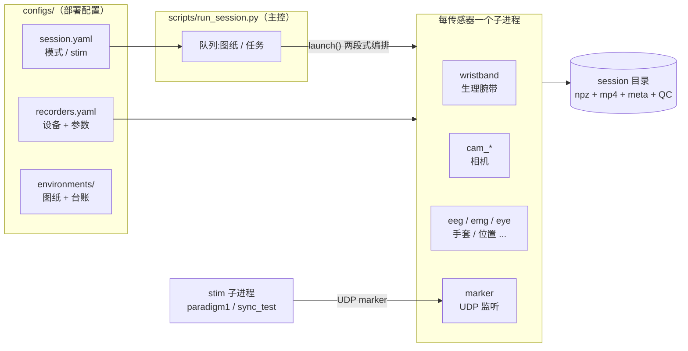
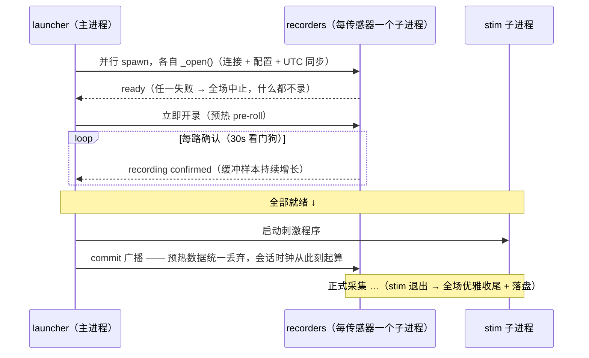
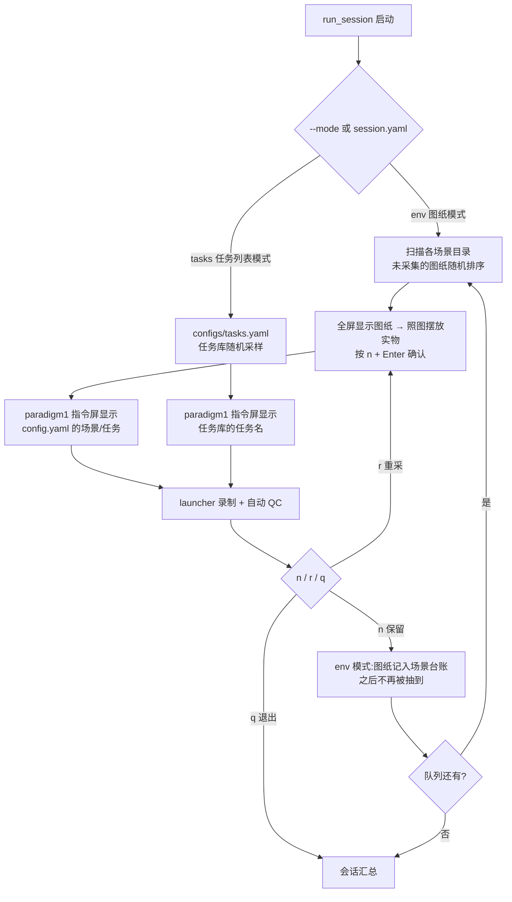
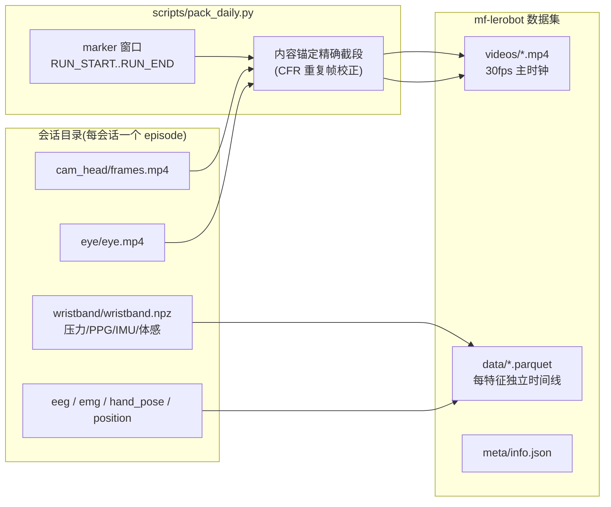

# embodied-brain-collect

**多模态具身数据采集框架** —— 眼动、RGB 相机、EEG、EMG、数据手套、位置跟踪、
生理腕带、任务标记，一台电脑同时采集；录完一键打包成多频率 LeRobot 数据集。

```
预检硬件 → 检查相机 → 抽队列(图纸/任务) → 逐项录制 + QC → 保留/重采 → 收班打包
   ↑                                                            ↓
   └──────────────  一条命令: python scripts/run_session.py  ────┘
```

---

## 目录

- [总览](#总览)
- [硬件一览](#硬件一览)
- [安装](#安装)
- [工作原理：两段式启动](#工作原理两段式启动)
- [采集模式：图纸模式 / 任务列表模式](#采集模式图纸模式--任务列表模式)
- [采集员操作说明](#采集员操作说明)
  - [1. 开班前检查](#1-开班前检查)
  - [2. 白班采集（session-day）](#2-白班采集session-day)
  - [3. 夜班采集（session-night）](#3-夜班采集session-night)
  - [4. 图纸摆放与确认（仅图纸模式）](#4-图纸摆放与确认仅图纸模式)
  - [5. 保留 / 重采 / 退出](#5-保留--重采--退出)
  - [6. 收班：数据打包（白班 + 夜班）](#6-收班数据打包白班--夜班)
  - [7. 图纸台账管理](#7-图纸台账管理)
- [配置文件](#配置文件)
- [数据打包详解（mf-lerobot）](#数据打包详解mf-lerobot)
- [自动 QC](#自动-qc)
- [脚本一览](#脚本一览)
- [目录结构](#目录结构)
- [数据格式与时间戳](#数据格式与时间戳)
- [刺激程序](#刺激程序)
- [测试](#测试)
- [常见问题](#常见问题)

---

## 总览



一个 launcher 并行管理所有传感器（每传感器独立进程），所有设备**首条数据就绪后
统一开录**；视频统一 libx265 帧精确编码；腕带用设备 UTC 时钟（0x20 指令同步）；
录完自动跑质量检查并生成自包含网页报告；收班后一条命令把全天数据打包成
**mf-lerobot 多频率数据集**（每传感器独立 parquet，查询时按时间窗对齐）。

## 硬件一览

| 模态 | 设备 | 采集实现 |
|---|---|---|
| 头戴相机 | OAK-D（DepthAI） | `depthai_camera` |
| 手腕相机 ×2 + 第三视角 | USB 相机（OpenCV） | `opencv_camera` |
| 眼动 | Pupil Neon | `neon_eye_async` |
| EEG | Curry EEG（TCP） | `curry_eeg` |
| EMG ×2 | WAVELETECH 8 通道臂环（CP210x 串口） | `weili_emg` |
| 手部姿态 | MANUS 数据手套 | `manus_hand_pose` |
| 位置跟踪 | OpenVR tracker | `openvr_position` |
| 生理腕带 | THU-PULSE（BLE，压力/PPG/IMU/体温/血氧） | `wristband` |
| 标记 | ParallelBox TTL + UDP | `udp_marker` / stim 的 `MarkerSender` |

所有实现都带 `dummy` 版（无硬件试跑全链路）。可选依赖（openvr / depthai /
pyrealsense2 / pupil_labs / pycbsdk / serial …）全部**懒加载**：装哪个 SDK
就能用哪个 recorder，互不牵连。

## 安装

依赖：Python ≥ 3.10，系统需安装 `ffmpeg`（含 libx265，视频编码与打包都用；
Windows 采集机用仓库 third_party 自带的 exe，见第 2 步）。

### 1. Python 环境

```bash
conda create -n Embodied-Brain-Collect python=3.10
conda activate Embodied-Brain-Collect
pip install -r requirements.txt
pip install -e .
```

> 命令行脚本都自带 `sys.path` 引导，直接 `python scripts/xxx.py` 即可。
> **装包用 `python -m pip`，不要用裸 `pip`**——裸 `pip` 可能指向系统 Python
> （报 externally-managed-environment 就是这个原因）。

### 2. third_party（第三方二进制，不入 git）

仓库不含闭源 SDK 与 Windows 二进制。从 GitHub **Release** 下载
`third_party.tar.gz` 附件，解压到**仓库根**（解压后得到 `third_party/`；
附件名以实际 Release 为准）：

```bash
curl -L https://github.com/Koorye/Embodied-Brain-Collect/releases/latest/download/third_party.tar.gz | tar xz
```

| 内容 | 用途 |
|---|---|
| `ffmpeg.exe` / `ffprobe.exe` | Windows 采集机的视频写盘/打包（Linux 走系统 PATH） |
| `MANUS_Core_3.1.1_SDK/` | Manus 手套 SDK（Windows dll + Linux so） |
| `manus_glove/` | 手套数据发布包，editable 安装（下一步） |

### 3. Manus 手套包

```bash
pip install -e third_party/manus_glove
```

### 4. 数据打包（可选，打包机需要）

还需要姊妹项目 **Embodied-Brain-Dataset** 的 `mf_lerobot` 包（私有仓库，
地址向管理员索取）：克隆到与本仓库**同级的目录**，editable 安装：

```bash
git clone <Embodied-Brain-Dataset 仓库地址> ../Embodied-Brain-Dataset
pip install -e ../Embodied-Brain-Dataset
python -m pip install lerobot==0.3.3
```

## 工作原理：两段式启动

设备"打开成功"证明不了"吞吐正常"。launcher 用两段式启动保证**每一路都真的
在产数**之后才开刺激程序：



任何一路确认失败（比如腕带连上了但不推数据流），整场中止、**预热数据不落盘**、
stim 永远不会启动——不会留下缺模态的坏数据。

## 采集模式：图纸模式 / 任务列表模式

`scripts/run_session.py` 支持两种队列模式，通过 CLI 或 `configs/session.yaml`
选择（CLI 显式传参优先）：



| | `--mode env`（图纸模式，默认） | `--mode tasks`（任务列表模式） |
|---|---|---|
| 队列 | 各场景目录**未采集**的图纸 | `configs/tasks.yaml` 任务库 |
| 开录门槛 | 全屏图纸 → 摆放 → **n + Enter** | 控制台 Enter |
| stim 指令屏 | 图纸所在场景目录 `config.yaml` 的场景/任务 | tasks.yaml 的任务名 |
| 成功记账 | 图纸写入**该场景目录**的 `used.yaml` | meta 记 task_id/task_name |

`--stim` 可选 `paradigm1`（pick & place 范式）或 `sync_test`（时钟同步测试），
**所有 stim 在图纸模式下都会在画面上显示图纸对应的场景/任务**。
模式与 stim 也可以写在 `configs/session.yaml` 里作为班次默认值。

## 采集员操作说明

> 本节是采集员的逐步操作手册。白班数据落在本机 `data/session-day/`，
> 夜班落在 `data/session-night/`，互不混放；收班时分别打包。

### 1. 开班前检查

```bash
conda activate Embodied-Brain-Collect

# 全部传感器预检:逐个打开 + 确认数据在流,失败会给出分设备排查建议
python scripts/preflight.py

# 相机体检:每个相机开一个窗口,核对画面与编号
python scripts/check_cameras.py          # --list 只列设备,--idx 2 只看某一路
```

预检全绿再开始采集。任一设备失败：按提示拔插/重启对应设备后重跑，
不要带病开录。

### 2. 白班采集（session-day）

```bash
# 图纸模式(默认):队列来自 configs/environments 未采集的图纸
python scripts/run_session.py --session-dir data/session-day

# 任务列表模式:队列来自 configs/tasks.yaml
python scripts/run_session.py --session-dir data/session-day --mode tasks

# 指定刺激程序 / 固定队列顺序 / 无人值守
python scripts/run_session.py --session-dir data/session-day --stim paradigm1
python scripts/run_session.py --seed 42 --auto-keep
```

打印队列后**按 Enter 开始**。图纸模式的每一项：

1. 程序全屏弹出**目标摆放图纸**（顶部是场景名与图纸编号）
2. **照图摆放实物**（桌上的物件按图纸位置摆好）
3. 摆好后按 **n，再按 Enter** —— 图纸关闭，正式开始录制
   （其他按键无效；未确认直接关窗 = 取消本次，不开录）
4. 刺激程序自动运行，完成后自动 QC

### 3. 夜班采集（session-night）

与白班完全一致，只换班次根目录：

```bash
python scripts/run_session.py --session-dir data/session-night
```

每次录制生成独立目录 `{班次根}/yyyy-MM-dd-HH-mm-ss/`（重采自动加后缀，
绝不覆盖旧数据），目录内：

```
2026-09-14-15-33-14/
├── meta.yaml            # 版本 / 任务 / 图纸 / 开始时间 / 各路 recorder 名
├── wristband/           # 腕带 npz + 日志
├── cam_head/            # frames.mp4 + 时间戳 npz(每路相机同理)
├── eye/  eeg/  emg_left/  emg_right/  hand_pose/  position/  marker/
├── qc_report.json       # QC 报告(数据)
└── qc.html              # 自包含网页报告(浏览器直接打开)
```

### 4. 图纸摆放与确认（仅图纸模式）

* 图纸按屏幕等比缩放全屏显示，顶部写明场景与图纸编号
* 摆放没有时间限制——**按 n 之后还有一次 Enter 确认**，中间反悔可继续调整
* 只有 `n + Enter` 会开始采集；**其他按键一律无效**（底部会提示"输入无效"）
* 不小心直接关掉窗口 = 取消本次：目录留档但**没有录任何数据**，
  图纸也不会被消耗，重新选它即可

### 5. 保留 / 重采 / 退出

每次录完（自动 QC 已跑）会要求输入字母 + Enter，防误触：

| 输入 | 含义 | 图纸模式的记账 |
|---|---|---|
| `n` | **保留**，进入下一张/下一个 | ✅ 图纸记入台账，之后不再出现 |
| `r` | **重采**，目录留档，马上重录同一张 | ❌ 不记账，图纸还在池里 |
| `q` | **退出**本次班次 | ❌ 不记账 |

**只有"保留"算采集成功**。全部完成后打印班次汇总（产量、无误比例、
QC 问题分布），并写入 `run_summary.json`。QC 只供参考：有 ERROR 的录制
也可以保留，由你拍板。

### 6. 收班：数据打包（白班 + 夜班）

收班时指定班次（`day` / `night`）即可自动定位数据并按当日日期分配输出目录；
日期可省略（默认当天），也可显式指定：

```bash
# ---- 白班 ----
python scripts/pack_daily.py day                     # 打包当天
python scripts/pack_daily.py day --date 2026-09-15   # 打包指定日期

# ---- 夜班 ----
python scripts/pack_daily.py night
python scripts/pack_daily.py night --date 2026-09-14

# 通用参数
python scripts/pack_daily.py day --force            # 覆盖已存在的输出
python scripts/pack_daily.py day --full             # 不按 marker 窗口裁剪
python scripts/pack_daily.py day --max-episodes 2   # 试打包前 2 个会话
```

自动对应：白班 → `data/session-day/<日期>-*`，输出
`data/lerobot/session-day/<日期>/`；夜班 → `data/session-night/<日期>-*`，
输出 `data/lerobot/session-night/<日期>/`。

* 每个会话打包成一个 episode；默认裁剪到 **RUN_START..RUN_END** marker
  窗口（`--full` 保留整段）
* 打包内容：视频（`observation.images.*`）、腕带全部信号（压力/PPG/IMU/
  体温/血氧）、EEG、EMG+IMU、眼动注视+IMU、手部姿态+骨架、每台位置
  追踪器的位姿、marker 事件码——各传感器保持**原生采样率**独立存储
* 额外派生两个策略训练特征（58 维，设备位姿 ×3 + 40 手部关节）：
  `observation.state` 与 `action`
* meta 的 `info.json` 记录 `collect_version`（采集程序版本）与
  `hardware`（每槽位设备显示名；新版 session meta 已有，旧数据回退
  默认设备表）

输出（LeRobot 标准结构 + 多频率扩展）：

```
data/lerobot/session-day/2026-09-15/
├── meta/info.json          # fps、特征表、collect_version、hardware
├── meta/tasks.jsonl        # 任务列表
├── data/chunk-000/         # 每特征一个 parquet(时间索引)
│   ├── episode_000000/observation.state.parquet
│   ├── episode_000000/observation.wristband_ppg.parquet
│   └── ...
└── videos/chunk-000/observation.images.head_rgb/episode_000000.mp4
```

读取：

```python
from mf_lerobot import MultiFrequencyLeRobotDataset
ds = MultiFrequencyLeRobotDataset(
    repo_id="session-day-2026-09-15",
    root="data/lerobot/session-day/2026-09-15")
item = ds[100]   # 各传感器按时间窗对齐后的字典
item["observation.state"]   # (58,) 拼接状态
item["action"]              # (58,) 与 state 同源
```

### 7. 图纸台账管理

每个场景目录的 `used.yaml` 就是该目录"已采集图纸"的唯一状态：

```yaml
# configs/environments/餐桌_水果放盘子/used.yaml
used:
  0001_combo006_r1.png:
    session: data/session-day/2026-09-15-10-00-00
    at: '2026-09-15 10:03:21'
```

* 抽取自动跳过台账里的图纸；**删掉某条记录即可让该图纸重新入池**
* 新增图纸：把 `NNNN_comboNNN_rN.png` 丢进对应场景目录即可，下次启动自动入池
* 新增场景：在 `configs/environments/` 下建新目录（目录名 = 场景名），
  放入 `config.yaml`（`task` + `scene.name`）与图纸

## 配置文件

所有部署参数在仓库根目录 **`configs/`**（不在代码里）：

| 文件 | 内容 |
|---|---|
| `recorders.yaml` | 每个传感器 slot：实现（`kind`）、可选显示名（`name`，写入 meta）、全部参数（相机 idx、COM 口、波特率、`hz`）。注释里写着"为什么是这个值" |
| `session.yaml` | run_session 的班次默认：`mode`（env/tasks）、`stim`（paradigm1/sync_test）。CLI 传参优先 |
| `tasks.yaml` | 任务库（task_id + 中文名），只读。**图纸模式下不参与队列**，仅任务列表模式使用 |
| `stim.yaml` | MarkerSender 传输参数 + 每个 stim 的参数（全屏、时长、时间压缩） |
| `environments/` | 图纸池：按场景目录存放 `config.yaml` + 图纸 PNG + 台账 `used.yaml` |
| `checker.yaml` | QC 各检查的阈值（缺项用代码默认值） |
| `meta.yaml` | 框架版本等元信息，每次采集时抄进 session 目录 |

环境变量 `EMBODIED_BRAIN_COLLECT_CONFIGS` 可指向其他配置目录（测试/多部署）。

`recorders.yaml` 里的 `name` 是设备显示名（如 "OAK-D-LITE"），会随本次会话
写进 `meta.yaml` 的 `recorders` 字段：

```yaml
recorders:
  cam_head: OAK-D-LITE
  emg_left: Weili EMG
  wristband: MaiYuan
```

## 数据打包详解（mf-lerobot）

基于姊妹项目 `mf_lerobot`（Multi-Frequency LeRobot）实现：**每个传感器以
原生采样率独立存为一个时间索引 parquet**，读取时按时间窗口动态对齐——
不做任何上采样/下采样，不丢原始时间精度。



* **主时钟**：相机 30fps（`cam_head` 优先，自动回退其他视频槽位），
  `task` 特征按主时钟逐帧记录任务标签
* **视频截段**：ffmpeg 从源 mp4 直接截出 episode 窗口并归一化到 30fps——
  不经逐帧解码/PNG 中间态；**内容锚定**校正 CFR 重复帧带来的截段偏移
  （每路视频截段后自验，残差 ≤ ±1 帧）
* **时间戳**：统一 rebase 到 episode 首个主时钟帧（无负值）；腕带用
  设备 UTC 钟（0x20 同步），EEG 用 marker 拟合对齐到 PC 钟
* 只出现在部分会话的流会整体舍弃（保证 meta 特征集在每个 episode 完整）
* `--full` 可忽略 marker 窗口保留整段录制

## 自动 QC

采集结束（所有 recorder 保存完）后自动跑 QC：控制台完整报告 +
`qc_report.json` + 自包含 `qc.html`（所有传感器画在同一条时间轴上，
全分辨率，问题处自动插帧）。`--skip-qc` 跳过；手动复跑：

```bash
python scripts/qc.py data/session-day/2026-09-15-10-00-00
python scripts/qc_report.py data/session-day/2026-09-15-10-00-00   # 生成 qc.html
```

QC 结论不改变录制结果，只供参考。

## 脚本一览

| 脚本 | 作用 |
|---|---|
| `scripts/run_session.py` | **主控**：`--mode env/tasks` × `--stim` → 逐项录制+QC → n/r/q → 汇总 |
| `scripts/pack_daily.py` | **每日数据打包**：按日期把白班/夜班会话打包成 mf-lerobot 数据集 |
| `scripts/session_summary.py` | 现有数据汇总：产量、任务覆盖、质量问题统计 |
| `scripts/preflight.py` | 预检：逐 recorder 打开 + 数据流探测，输出分设备排查建议 |
| `scripts/check_cameras.py` | 相机体检：枚举 + 实时画面 |
| `scripts/qc.py` / `qc_report.py` | 手动 QC / 生成 qc.html |
| `scripts/rebuild_emg_timestamps.py` | 旧 session 的 EMG 时间戳回填（默认 dry-run，`--write` 生效） |
| `scripts/update_meta_names.py` | 历史数据 meta 补齐/更新各槽位设备显示名（名源 = recorders.yaml 的 `name`；默认 dry-run 预览效果直接生效，`--dry-run` 只看） |

## 目录结构

```
configs/                        # 部署配置
  recorders.yaml                #   传感器槽位与参数(kind/name/hz/...)
  session.yaml                  #   run_session 默认(mode/stim)
  tasks.yaml                    #   任务库(只读)
  stim.yaml                     #   刺激程序参数
  checker.yaml  meta.yaml
  environments/                 #   图纸池(按场景目录)
    餐桌_水果放盘子/
      config.yaml               #     task + scene 定义
      0001_combo006_r1.png      #     图纸
      used.yaml                 #     该场景的采集台账
scripts/                        # 工作流脚本(见上)
src/embodied_brain_collect/
  recorders/                    # 各模态 recorder(+dummy;可选 SDK 懒加载)
    emg/timestamp_rebuild.py    #   EMG 逐帧时间戳重建
  session/                      # launcher、recorder 工厂、图纸环境、配置装载
    launcher.py                 #   两段式启动 + 多进程编排
    environment.py              #   Environment 类:图纸池/台账/全屏显示
    config.py                   #   configs/ 装载
    recorder_presets.py         #   yaml → recorder 实例工厂
    troubleshooting.py          #   分设备排查指引
  stim/                         # 刺激程序(base_stim 骨架 + paradigm1/sync_test)
  checkers/                     # 组合式 QC
  visualizers/                  # QC 网页渲染
tests/                          # pytest + 硬件 GUI 测试
third_party/                    # 第三方二进制(git 忽略,Release 附件解压)
  ffmpeg.exe  ffprobe.exe       #   Windows 采集机的 ffmpeg/ffprobe
  MANUS_Core_3.1.1_SDK/         #   Manus 手套 SDK
  manus_glove/                  #   手套数据发布包(pip install -e)
data/                           # 采集输出与打包结果(git 忽略)
  session-day/  session-night/  #   白班 / 夜班 班次根
  lerobot/                      #   打包产物
```

## 数据格式与时间戳

### 采集输出（`{session_dir}/{slot}/`）

| 传感器 | 文件 |
|---|---|
| 相机 | `frames.mp4` + `<slot>.npz`（`frames_timestamps`，与容器帧 1:1） |
| 眼动 | `eye.npz`（gaze/imu/scene）+ `eye.mp4` |
| 腕带 | `wristband.npz`（压力 150Hz / PPG 100Hz / IMU 50Hz / 体感，时间戳已展开） |
| 其余 | `<slot>.npz` + `<slot>.log` |

session 根下另有 `meta.yaml`（版本/任务/图纸/开始时间/各路 recorder 名）、
`qc_report.json`、`qc.html`。视频为 libx265 HEVC，`bframes=0` + 每秒关键帧——
容器帧序号与时间戳数组下标严格 1:1。

### 时间戳语义

所有时间戳都是绝对 unix 秒（float64），各流对齐不需要换算：

| 流 | 时钟 | 说明 |
|---|---|---|
| 相机 / marker / 位置 / 手套 | 主机钟 | `time.time()` |
| 腕带 | **设备 UTC 钟** | open 时由 0x20 指令同步；未同步的帧会被丢弃（保证没有坏时间戳入库） |
| EEG | 放大器钟 | close 时用 marker 序列拟合 `t_pc = a·t_eeg + b` 映射到主机钟；拟合不可信则不保存时间戳（QC 报错） |

### EMG 时间戳（臂环，重点）

臂环 2000 Hz 输出，Windows 串口读缓冲导致 ~99% 时间戳重复且滞后半批。
recorder 收尾时用 8 位序列号重建逐帧时间戳（unwrap → 批末帧锚点
Theil–Sen 稳健初估 → 迭代 3σ 剔离群精修）：实测拟合速率 1999.997 Hz（3 ppm）、零重复零回退。
原始到达值保留为 `emg_arrival_timestamps`。

**旧数据回填**（默认 dry-run，`--write` 生效）：

```bash
python scripts/rebuild_emg_timestamps.py data/session-night/2026-08-24-18-09-17 --write
```

## 刺激程序

```
base_stim.py             BaseStim —— 所有范式共享骨架:
                         pygame 窗口/字体、MarkerSender(串口 TTL + UDP 双路)、
                         Esc 中止、SPACE 等待、--environment 场景显示、
                         公共 CLI 参数
paradigm1_pickplace.py   范式1: 注视 → 指令 → 运动想象 → pick & place
sync_test.py             同步测试: 全自动想象/手势序列 + 毫秒计时画面
factory.py               按 kind 构建子进程命令
```

`--environment`（图纸模式自动传入）让**所有 stim** 的画面显示图纸对应的
场景/任务。新写范式只需继承 `BaseStim` 实现 `run_flow()`。marker 码表见
`stim/marker_codes.py`，UDP 包带发送端 PC 时间戳。

## 测试

```bash
pytest tests/checkers tests/visualizers       # 纯软件,50+ 用例
python -m tests.eye.test_neon_eye_async       # 硬件 GUI 测试(需显示器)
```

## 常见问题

* **腕带连上但没数据 / 很快掉线**：腕带是 BLE 设备，连续快速重连后固件可能
  没重启测量流——给腕带断电重开再试；系统蓝牙被 GNOME 设置面板占用也会干扰，
  采集时关掉蓝牙设置页。recorder 有确认闸门：连上但不推数据时整场会中止
  而不是留下空数据。
* **EMG 打不开 / 没数据**：先检查线缆——臂环 USB 线接触不良是最常见原因。
* **EMG 时间戳大量重复**：旧数据未重建，跑一次 `rebuild_emg_timestamps.py`。
* **相机 idx 对不上**：用 `scripts/check_cameras.py` 看每个索引实际是哪台相机，
  再改 `recorders.yaml`。
* **图纸显示不出来 / 中文变方框**：确认系统装有中文字体（微软雅黑/SimHei/
  Noto CJK 任一）；控制台会打印所用后端与字体信息。
* **qc.html 太大**：`python scripts/qc_report.py <session> --no-frames`
  或调低 `--fps` / `--thumb-width`。
* **打包报"输出目录已存在"**：加 `--force` 覆盖，或换 `--out`。
* **Windows 下 Ctrl+C 不响应**：recorder 子进程用 spawn 启动，脚本入口必须带
  `if __name__ == "__main__":` 保护——仓库内脚本都已处理。

## 版本

当前版本 **1.2.1**，历史见 [CHANGELOG.md](CHANGELOG.md)。

## v1.2.1 改动概览

1. **eye 视频完整性修复**：时间戳改到写盘成功后记账，停止时先排空写盘
   队列再关 ffmpeg（消除"差 1 帧"）；写盘任务纳入录制循环监督，ffmpeg
   中途死亡立即判会话失败（消除"只有 1 帧"的静默坏数据）。
2. **帧数-时间戳严格相等**：`FrameCountMatch` 取消 2% 容差，任何不等直接
   ERROR；`reqc_all.py` 重写为全部视频核对 + ffprobe 元数据计数（不再
   逐帧解码，毫秒级），`--write` 回写 qc_report，exit code 可当闸门。
3. **ffmpeg/ffprobe 统一封装**：新增 `embodied_brain_collect.utils.media`
   （`media_tool` + `ffprobe_count`），录制端 ffmpeg_writer 与
   pack_daily/reqc_all 三处统一走它（Windows 用 third_party exe，
   Linux 用系统命令）。

## v1.2.0 改动概览

1. **图纸模式**：`configs/environments` 图纸池 + 全屏摆放确认（n+Enter）+
   按场景目录独立台账；`run_session` 支持 `--mode env/tasks` 与 `--stim`
   切换，默认值来自 `configs/session.yaml`。
2. **生理腕带 recorder（wristband）**：BLE 协议 V1.5，压力/PPG/IMU/体温/血氧，
   0x20 UTC 同步 + 确认闸门。
3. **每日数据打包 `pack_daily.py`**：按日期把会话打包成 mf-lerobot 多频率
   数据集（视频 ffmpeg 直通截段 + 内容锚定对齐，各传感器原生采样率独立存储）。
4. **recorder 显式 `name`**：`recorders.yaml` 的 `name` 写进 session 的
   meta.yaml（`recorders` 字段）。
5. **配置装载迁移**：`config/load.py` → `session/config.py`；可选 SDK 全部
   懒加载（装哪个 SDK 用哪个 recorder）。
6. **`session/environment.py` 的 `Environment` 类**：图纸池/台账/全屏显示
   （matplotlib 中文字体自动选择、n+Enter 确认状态机）。
