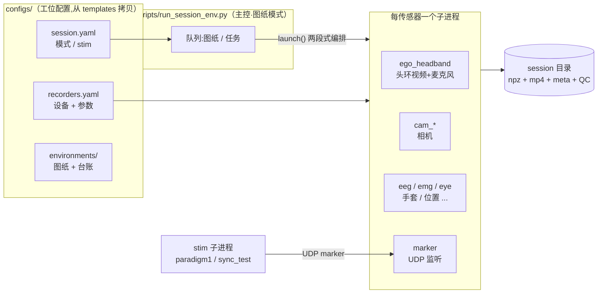
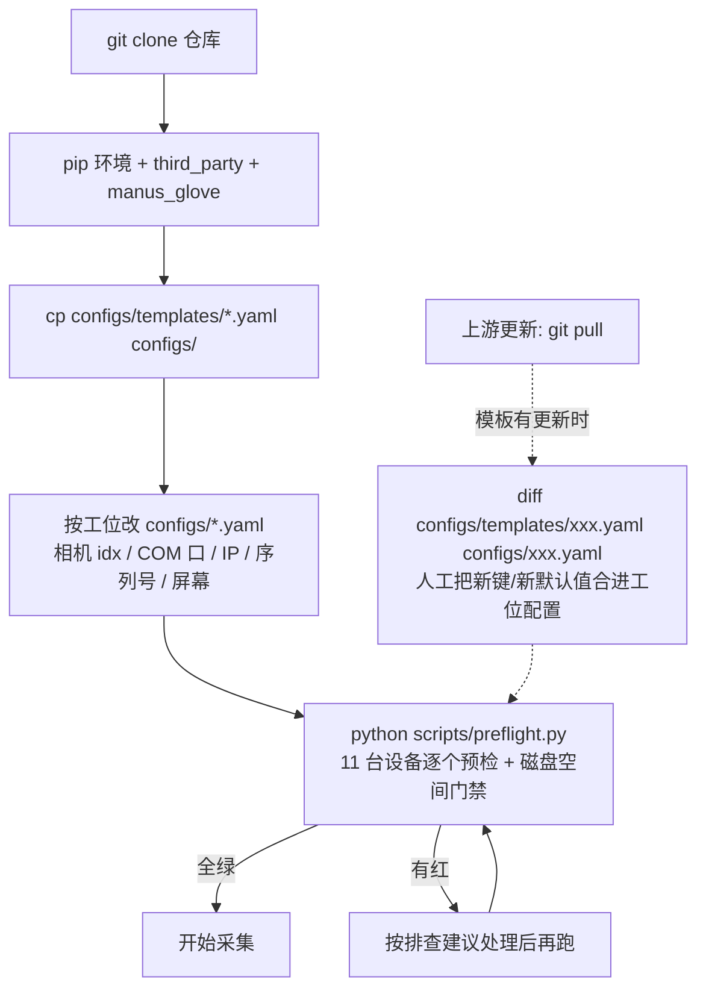
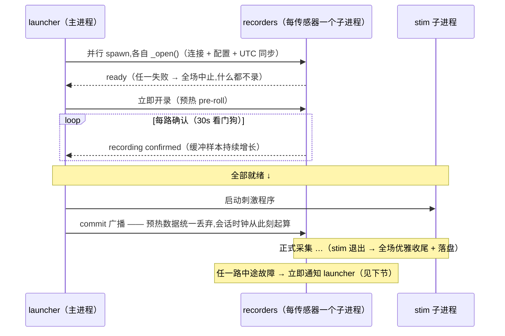
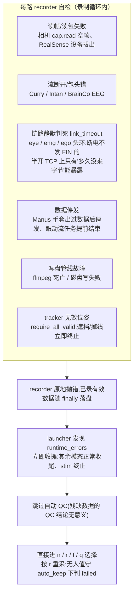
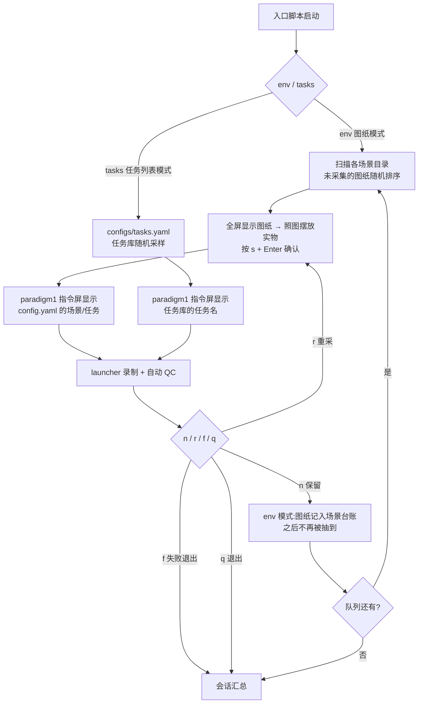
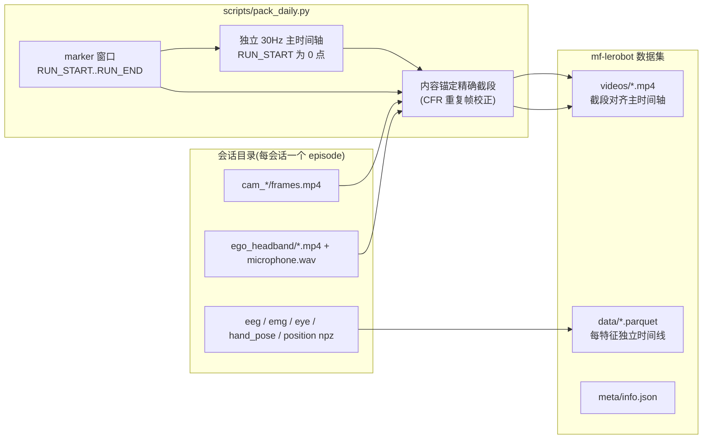
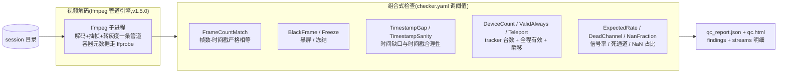

# embodied-brain-collect

**多模态具身数据采集框架** —— 眼动、RGB 相机、EEG、EMG、数据手套、位置跟踪、
ego 头环,一台电脑同时采集;录完一键打包成多频率 LeRobot 数据集。

 

```
预检硬件 → 检查相机 → 抽队列(图纸/任务) → 逐项录制 + QC → 保留/重采 → 批量打包
   ↑                                                            ↓
   └──────────────  一条命令: python scripts/run_session_env.py ────┘
```

---

## 目录

- [总览](#总览)
- [硬件一览](#硬件一览)
- [安装](#安装)
  - [首次部署:从模板生成工位配置](#5-首次部署从模板生成工位配置)
- [工作原理:两段式启动](#工作原理两段式启动)
- [录制中的故障保护(v1.5.0)](#录制中的故障保护v150)
- [采集模式:图纸模式 / 任务列表模式](#采集模式图纸模式--任务列表模式)
- [采集员操作说明](#采集员操作说明)
  - [1. 采集前检查](#1-采集前检查)
  - [2. 逐条采集](#2-逐条采集)
  - [3. 图纸摆放与确认(仅图纸模式)](#3-图纸摆放与确认仅图纸模式)
  - [4. 成功 / 失败 / 退出](#4-成功--失败--退出)
  - [5. 数据打包](#5-数据打包)
  - [6. 图纸台账管理](#6-图纸台账管理)
- [配置文件](#配置文件)
- [数据打包详解(mf-lerobot)](#数据打包详解mf-lerobot)
- [自动 QC](#自动-qc)
- [脚本一览](#脚本一览)
- [目录结构](#目录结构)
- [数据格式与时间戳](#数据格式与时间戳)
- [刺激程序](#刺激程序)
- [测试](#测试)
- [常见问题](#常见问题)
- [版本](#版本)

---

## 总览


```mermaid
flowchart LR
    subgraph CFG["configs/（工位配置,从 templates 拷贝）"]
        Y1["recorders.yaml<br/>设备 + 参数"]
        Y2["session.yaml<br/>模式 / stim"]
        Y4["environments/<br/>图纸 + 台账"]
    end

    subgraph RUN["scripts/run_session_env.py（主控·图纸模式）"]
        Q["队列:图纸 / 任务"]
    end

    subgraph PROC["每传感器一个子进程"]
        H["ego_headband<br/>头环视频+麦克风"]
        C["cam_*<br/>相机"]
        E["eeg / emg / eye<br/>手套 / 位置 ..."]
        M["marker<br/>UDP 监听"]
    end

    S["stim 子进程<br/>paradigm1 / sync_test"]

    Q -->|"launch() 两段式编排"| PROC
    Y1 --> PROC
    Y2 --> Q
    S -->|"UDP marker"| M
    PROC --> D[("session 目录<br/>npz + mp4 + meta + QC")]
```

一个 launcher 并行管理所有传感器（每传感器独立进程），所有设备**首条数据就绪后
统一开录**；视频统一 libx265 帧精确编码；录完自动跑质量检查并生成自包含网页
报告；采集结束后一条命令把当天数据打包成 **mf-lerobot 多频率数据集**（每传感器
独立 parquet,查询时按时间窗对齐）。

**v1.5.0 起录制全程有故障保护**：任一路设备在录制中途掉线/停流,launcher 立即
收摊、其余模态照常落盘,不会带着死掉的设备继续录出残缺数据（见
[录制中的故障保护](#录制中的故障保护v150)）。

## 硬件一览

| 模态 | 设备 | 采集实现 | 现役配置 |
|---|---|---|---|
| ego 头环 | Ego Headband V1.5(多路视频 + 麦克风,TCP) | `net_ego_headband` | ✅ |
| 手腕相机 ×2 | USB 相机(OpenCV) | `opencv_camera` | ✅ |
| 第三视角相机 | Intel RealSense D455f | `opencv_camera` | ✅ |
| 眼动 | Pupil Neon | `neon_eye_async` | ✅ |
| EEG | Compumedics Neuroscan SynAmps2(Curry,TCP) | `curry_eeg` | ✅ |
| EMG ×2 | WAVELETECH 8 通道臂环(CP210x 串口) | `weili_emg` | ✅ |
| 手部姿态 | MANUS Metaglove Pro Haptics | `manus_hand_pose` | ✅ |
| 位置跟踪 | HTC VIVE Tracker 3.0(OpenVR) | `openvr_position` | ✅ |
| 标记 | ParallelBox TTL + UDP | `udp_marker` | ✅ |
| 头戴相机 | OAK-D(DepthAI) | `depthai_camera` | 备选(模板中注释) |
| 生理腕带 | THU-PULSE(BLE,压力/PPG/IMU/体温/血氧) | `wristband` | 备选(模板中注释) |
| EEG 备选 | BrainCo BCIGo / Intan / Blackrock | `brainco_eeg` / `intan_eeg` / `blackrock_eeg` | 备选 |

所有实现都带 `dummy` 版（无硬件试跑全链路）。可选依赖（openvr / depthai /
pyrealsense2 / pupil_labs / pycbsdk / serial …）全部**懒加载**：装哪个 SDK
就能用哪个 recorder,互不牵连。

各硬件的开箱与配置教程（docs/，指认/配置 → 体检验证的完整流程）：

- [docs/vive_tracker.md](docs/vive_tracker.md) —— VIVE tracker 位置跟踪：SteamVR Null Driver 无头显配置、角色设置与位姿验证
- [docs/opencv_camera.md](docs/opencv_camera.md) —— USB 相机：idx 机制与漂移、`map_cameras.py` 人工指认、yaml 配置
- [docs/realsense_camera.md](docs/realsense_camera.md) —— RealSense D455f：serial 绑定、`map_realsense.py` 人工指认、yaml 配置
- [docs/emg.md](docs/emg.md) —— EMG 臂环 ×2：`map_emg.py` 逐台插入自动认口、`check_emg.py` 左右手对应检查
- [docs/manus.md](docs/manus.md) —— MANUS 手套：Manus Core 标定、`install_manus_calib.py` 安装 `.mcal`
- [docs/neon_eye.md](docs/neon_eye.md) —— Pupil Neon 眼动：手机 Neon app、与电脑同网段（mDNS 自动发现的前提）

（待补充：EEG、ego 头环）

## 安装

依赖：Python ≥ 3.10,系统需安装 `ffmpeg`（含 libx265,视频编码与打包都用;
Windows 采集机用仓库 third_party 自带的 exe,见第 2 步）。

### 1. Python 环境

```bash
conda create -n collect python=3.10
conda activate collect
pip install -r requirements.txt
pip install -e .
```

> 命令行脚本都自带 `sys.path` 引导,直接 `python scripts/xxx.py` 即可。
> **装包用 `python -m pip`,不要用裸 `pip`**——裸 `pip` 可能指向系统 Python
> （报 externally-managed-environment 就是这个原因）。

### 2. third_party（第三方二进制,不入 git）

仓库不含闭源 SDK 与 Windows 二进制。到 GitHub **Release** 页手动下载
`third_party.zip` 附件,解压到**仓库根**——确保解压后 `third_party/`
位于本仓库目录下（与 `src/`、`scripts/` 同级）即可。

| 内容 | 用途 |
|---|---|
| `ffmpeg.exe` / `ffprobe.exe` | Windows 采集机的视频写盘/打包/QC 解码(Linux 走系统 PATH) |
| `MANUS_Core_3.1.1_SDK/` | Manus 手套 SDK（Windows dll + Linux so） |
| `manus_glove/` | 手套数据发布包,editable 安装（下一步） |

### 3. Manus 手套包

```bash
pip install -e third_party/manus_glove
```

### 4. 数据打包（可选,打包机需要）

还需要姊妹项目
[Multi-Frequency-LeRobot](https://github.com/Koorye/Multi-Frequency-LeRobot)
的 `mf_lerobot` 包：克隆到与本仓库**同级的目录**,editable 安装：

```bash
git clone https://github.com/Koorye/Multi-Frequency-LeRobot.git ../Multi-Frequency-LeRobot
pip install -e ../Multi-Frequency-LeRobot
python -m pip install lerobot==0.3.3
```

### 5. 首次部署:从模板生成工位配置

**仓库只跟踪 `configs/templates/`（基准模板）,每个工位的实际配置不入 git。**
这样每台机器按自己的设备情况改配置,`git pull` 永远不会冲突;上游的协议级
参数更新随代码一起拉下来。

```bash
# 把全部模板拷贝为工位配置(一次性;已存在的文件不会被这条命令覆盖)
cp -n configs/templates/*.yaml configs/
```

然后按工位修改 `configs/*.yaml`——**只需要改和模板不一样的键**,典型工位差异：

| 键 | 在哪改 | 说明 |
|---|---|---|
| 相机序号 `idx` | `recorders.yaml` | USB 枚举顺序每台机器不同,用 `scripts/check_cameras.py` 核对 |
| EMG 串口 `port` | `recorders.yaml` | 如 `COM31`/`COM30`（Windows）,空 = 自动探测 |
| 头环地址 `host` | `recorders.yaml` | ego 头环设备 IP |
| tracker 序列号绑定 `role_serial_map` | `recorders.yaml` | 每台 tracker 的序列号↔角色,见 `scripts/check_vive.py` |
| 屏幕布局 | `displays.yaml` | 刺激屏/辅助屏的分辨率与全屏/窗口模式 |
| 采集员编号 `collector_id` | `session.yaml` | 随会话写进 meta 与打包信息 |


```mermaid
flowchart TD
    A["git clone 仓库"] --> B["pip 环境 + third_party + manus_glove"]
    B --> C["cp configs/templates/*.yaml configs/"]
    C --> D["按工位改 configs/*.yaml<br/>相机 idx / COM 口 / IP / 序列号 / 屏幕"]
    D --> E["python scripts/preflight.py<br/>11 台设备逐个预检 + 磁盘空间门禁"]
    E -->|全绿| F["开始采集"]
    E -->|有红| D2["按排查建议处理后再跑"] --> E
    G["上游更新: git pull"] -.->|"模板有更新时"| H["diff configs/templates/xxx.yaml configs/xxx.yaml<br/>人工把新键/新默认值合进工位配置"] -.-> E
```

两点说明：

* **升级不会自动改你的配置**:`git pull` 后 `configs/templates/` 里的模板会
  更新,但你已拷贝出去的 `configs/*.yaml` 不会被触碰(所以也永远不会冲突)。
  升级后用 `diff configs/templates/recorders.yaml configs/recorders.yaml`
  核对一遍,把新增键/推荐值手动合进来——模板注释里写着每个值"为什么是这个"。
* **图纸池 `configs/environments/` 不入 git**(体积大、现场持续产生台账),
  新工位从既有采集机整目录拷贝,之后由本机自主维护。

环境变量 `EMBODIED_BRAIN_COLLECT_CONFIGS` 可把整个配置目录指到别处
(测试/多部署)。

## 工作原理:两段式启动

设备"打开成功"证明不了"吞吐正常"。launcher 用两段式启动保证**每一路都真的
在产数**之后才开刺激程序：


```mermaid
sequenceDiagram
    participant L as launcher（主进程）
    participant R as recorders（每传感器一个子进程）
    participant S as stim 子进程
    L->>R: 并行 spawn,各自 _open()（连接 + 配置 + UTC 同步）
    R-->>L: ready（任一失败 → 全场中止,什么都不录）
    L->>R: 立即开录（预热 pre-roll）
    loop 每路确认（30s 看门狗）
        R-->>L: recording confirmed（缓冲样本持续增长）
    end
    Note over L,S: 全部就绪 ↓
    L->>S: 启动刺激程序
    L->>R: commit 广播 —— 预热数据统一丢弃,会话时钟从此刻起算
    Note over R,S: 正式采集 …（stim 退出 → 全场优雅收尾 + 落盘）
    Note over R: 任一路中途故障 → 立即通知 launcher（见下节）
```

任何一路确认失败（比如设备连上了但不推数据流）,整场中止、**预热数据不落盘**、
stim 永远不会启动——不会留下缺模态的坏数据。

## 录制中的故障保护(v1.5.0)

录制启动成功不等于录制全程平安——USB 掉线、设备断电、半开 TCP 断网都不会
产生任何显式异常,旧版会"静默录完"一份缺了一路的残缺数据。v1.5.0 把
**"任何一路死亡 = 立即收摊"** 贯彻到每个环节：


```mermaid
flowchart TD
    subgraph DETECT["每路 recorder 自检（录制循环内）"]
        D1["读帧/读包失败<br/>相机 cap.read 空帧、RealSense 设备拔出"]
        D2["流断开/包头错<br/>Curry / Intan / BrainCo EEG"]
        D3["链路静默判死 link_timeout<br/>eye / emg / ego 头环:断电不发 FIN 的<br/>半开 TCP 上只有'多久没来字节'能暴露"]
        D4["数据停发<br/>Manus 手套出过数据后停发、眼动流任务提前结束"]
        D5["写盘管线故障<br/>ffmpeg 死亡 / 磁盘写失败"]
        D6["tracker 无效位姿<br/>require_all_valid:遮挡/掉线立即终止"]
    end
    DETECT --> X["recorder 原地抛错,已录有效数据随 finally 落盘"]
    X --> L["launcher 发现 runtime_errors<br/>立即收摊:其余模态正常收尾、stim 终止"]
    L --> Q["跳过自动 QC(残缺数据的 QC 结论无意义)"]
    Q --> N["直接进 n / r / f / q 选择<br/>按 r 重采;无人值守 auto_keep 下判 failed"]
```

* **link_timeout(链路静默判死)**：eye / EMG / ego 头环可配"连续多久没收到
  字节即判连接已死",出过字节后才武装(慢启动不误伤),`0` = 关闭——
  半开 TCP/串口上设备断电不会有任何异常,只有静默时长能暴露它。
* **require_all_valid(tracker 看门狗)**:录制中任一台 tracker 出现无效 pose
  (遮挡/掉线/断光塔)立即终止;launcher 预热段(commit 前)豁免。
  QC 侧另有同口径的 `ValidAlways` 检查复核落盘数据,看门狗关闭或独立录制
  时旧数据照样拦在打包门外。
* **职责边界**:recorder 只负责"发现并抛错",launcher 负责收摊决策——
  单路死亡不会拖死其他路,它们走正常 finally 落盘。

## 采集模式:图纸模式 / 任务列表模式

入口脚本按模式拆分:`run_session_env.py`（图纸）与 `run_session_tasks.py`
（任务列表）——`run_session.py` 按 `--mode` 或 `configs/session.yaml` 转发,
兼容旧命令。stim 的选择两者一致（CLI 显式传参优先）：


```mermaid
flowchart TD
    ST[入口脚本启动] --> MODE{"env / tasks"}
    MODE -->|env 图纸模式| E1[扫描各场景目录<br/>未采集的图纸随机排序]
    MODE -->|tasks 任务列表模式| T1[configs/tasks.yaml<br/>任务库随机采样]
    E1 --> E2["全屏显示图纸 → 照图摆放实物<br/>按 s + Enter 确认"]
    E2 --> E3["paradigm1 指令屏显示<br/>config.yaml 的场景/任务"]
    T1 --> T3[paradigm1 指令屏显示<br/>任务库的任务名]
    E3 --> REC["launcher 录制 + 自动 QC"]
    T3 --> REC
    REC --> KEEP{"n / r / f / q"}
    KEEP -->|"n 保留"| OK["env 模式:图纸记入场景台账<br/>之后不再被抽到"]
    KEEP -->|"r 重采"| E2
    KEEP -->|"f 失败退出"| END[会话汇总]
    KEEP -->|"q 退出"| END[会话汇总]
    OK --> MORE{"队列还有?"}
    MORE -->|是| E1
    MORE -->|否| END
```

| | `run_session_env.py`（图纸模式,默认） | `run_session_tasks.py`（任务列表模式） |
|---|---|---|
| 队列 | 各场景目录**未采集**的图纸 | `configs/tasks.yaml` 任务库 |
| 开录门槛 | 全屏图纸 → 摆放 → **s + Enter** | 控制台 Enter |
| stim 指令屏 | 图纸所在场景目录 `config.yaml` 的场景/任务 | tasks.yaml 的任务名 |
| 成功记账 | 图纸写入**该场景目录**的 `used.yaml` | meta 记 task_id/task_name |

`--stim` 可选 `paradigm1`（pick & place 范式）或 `sync_test`（时钟同步测试）,
**所有 stim 在图纸模式下都会在画面上显示图纸对应的场景/任务**。
模式与 stim 也可以写在 `configs/session.yaml` 里作为运行默认值。

## 采集员操作说明

> 本节是采集员的逐步操作手册。数据落在本机 `data/<批次根>/`（如
> `data/session-day`,名字自取）,每次录制一个 `<日期>-<时间>` 子目录;
> 采集结束后按批次根批量打包。

### 1. 采集前检查

```bash
conda activate collect

# 全部传感器预检:逐个打开 + 确认数据在流,失败会给出分设备排查建议;
# 同时检查磁盘剩余空间(<50GB 拒绝开录,<100GB 警告——一轮采集约 1GB/分钟)
python scripts/preflight.py

# 相机体检:每个相机开一个窗口,核对画面与编号
python scripts/check_cameras.py          # --list 只列设备,--idx 2 只看某一路

# EMG 左右手对应检查:窗口实时显示双手 8 通道波形,
# 按 L/R 分别晃动左/右手,自动对照 + 肉眼核对,无接反后 Y 退出
python scripts/check_emg.py              # --list 只列左右槽位配置

# VIVE tracker 体检:实时显示每台位置与轨迹,核对左右手绑定
python scripts/check_vive.py             # --list 只列出当前连接的 tracker
```

预检全绿再开始采集。任一设备失败:按提示拔插/重启对应设备后重跑,
不要带病开录。

### 2. 逐条采集

```bash
# 图纸模式(默认):队列来自 configs/environments 未采集的图纸
python scripts/run_session_env.py --session-dir data/session-day

# 任务列表模式:队列来自 configs/tasks.yaml
python scripts/run_session_tasks.py --session-dir data/session-day

# RLHF 视频打分:子集来自 configs/videos/<任务>(见该目录 README)
python scripts/run_session_video.py --subset 盖笔盖

# 指定刺激程序 / 固定队列顺序 / 无人值守
python scripts/run_session_env.py --session-dir data/session-day --stim paradigm1
python scripts/run_session_env.py --seed 42 --auto-keep
```

> 批次根目录名自取（上面的 `session-day` 只是示例）;不同批次用不同目录,
> 数据互不混放。

打印队列后**按 Enter 开始**。图纸模式的每一项：

1. 程序全屏弹出**目标摆放图纸**（顶部是场景名与图纸编号）
2. **照图摆放实物**（桌上的物件按图纸位置摆好）
3. 摆好后按 **s，再按 Enter** —— 图纸关闭,正式开始录制
   （其他按键无效;未确认直接关窗 = 取消本次,不开录）
4. 刺激程序自动运行,完成后自动 QC

每次录制生成独立目录 `{批次根}/yyyy-MM-dd-HH-mm-ss/`（重跑自动加后缀,
绝不覆盖旧数据）,目录内：

```
2026-09-14-15-33-14/
├── meta.yaml            # 版本 / 任务 / 图纸 / 开始时间 / 各路 recorder 名
├── ego_headband/        # 头环多路视频 mp4 + microphone.wav + 时间戳 npz
├── cam_left_wrist/      # frames.mp4 + 时间戳 npz(每路相机同理)
├── eye/  eeg/  emg_left/  emg_right/  hand_pose/  position/  marker/
├── qc_report.json       # QC 报告(数据)
└── qc.html              # 自包含网页报告(浏览器直接打开)
```

> 录制中有设备故障退出时(v1.5.0),launcher 会提前收摊并打印是哪一路、
> 跳过 QC 直接让你选 n/r/f/q——**按 r 重采**即可,已落盘的部分数据保留
> 在原目录里供排查。

### 3. 图纸摆放与确认（仅图纸模式）

* 图纸按屏幕等比缩放全屏显示,顶部写明场景与图纸编号
* 摆放没有时间限制——**按 s 之后还有一次 Enter 确认**,中间反悔可继续调整
* 只有 `s + Enter` 会开始采集;**其他按键一律无效**（底部会提示"输入无效"）
* 不小心直接关掉窗口 = 取消本次:目录留档但**没有录任何数据**,
  图纸也不会被消耗,重新选它即可

### 4. 成功 / 失败 / 退出

每次录完（自动 QC 已跑）会要求输入字母 + Enter,防误触：

| 输入 | 含义 | 图纸模式的记账 |
|---|---|---|
| `n` | **保留数据**,进入下一张/下一个 | QC 无错 → 图纸记入台账,之后不再出现;QC 有错 → 不记账（会重新抽到重采） |
| `r` | **采集失败**,目录留档,马上重录同一张 | ❌ 不记账,图纸还在池里 |
| `q` | **退出**本次采集（当前这条按成功留档） | 同 `n` |

结局写进该条 `meta.yaml` 的 `status` 字段（三档合成：**QC 有 ERROR →
`error`,无论按什么键;QC 无错且按 `r` → `failed`;QC 无错且按 `n`/`q` →
`success`;录制中有 recorder 异常退出的会话在无人值守下同样判
`failed`,不冒充成功**）,随数据目录走,供打包与汇总识别单条数据的有效性;
**仅 `success` 记图纸台账**。全部完成后打印批次汇总（产量、无误比例、QC 问题
分布）,并写入 `run_summary.json`。

### 5. 数据打包

采集结束后一条命令按日期打包：在 `--source`（默认 `data/`）下查找
`<日期>-*` 会话目录（兼容 `data/<批次根>/<日期>-*` 一层嵌套）,输出到
`data/lerobot/<日期>-<起>-<止>/`——起止取**本次打包会话**的数据时间范围
（HH-MM-SS,优先各会话 marker 窗口,缺报告时回退目录名时刻）;指定
`--out` 时数据集同样自动进一层,落在 `<out>/<日期>-<起>-<止>/` 子目录。
日期可省略（默认当天）：

```bash
python scripts/pack_daily.py                          # 打包今天
python scripts/pack_daily.py --date 2026-09-16        # 打包指定日期

# 指定批次根与输出目录(数据集落在 <out>/<日期>-起-止/ 子目录)
python scripts/pack_daily.py --date 2026-09-16     --source data/session-batch1 --out data/lerobot/batch1

# 其他参数
python scripts/pack_daily.py --force            # 覆盖已存在的输出
python scripts/pack_daily.py --full             # 不按 marker 窗口裁剪
python scripts/pack_daily.py --max-episodes 2   # 试打包前 2 个会话
```

* 每个会话打包成一个 episode;默认裁剪到 **RUN_START..RUN_END** marker
  窗口（`--full` 保留整段）
* 打包内容：视频（`observation.images.*`）、头环多路视频 + 麦克风音频、
  EEG、EMG+IMU、眼动注视+IMU、手部姿态+骨架、每台位置追踪器的位姿
  (按**角色**命名)、marker 事件码,以及 EEG 阻抗门禁结果
  （`observation.eeg_impedance`,单行常量流:每通道均值 Ω + 通过率/门禁结论,
  Curry / BrainCo 开录门禁自动产出;关门禁的会话自动缺省,不影响打包）
  ——各传感器保持**原生采样率**独立存储
* 额外派生两个策略训练特征（58 维,设备位姿 ×3 + 40 手部关节）：
  `observation.state` 与 `action`
* `info.json` 保持 LeRobot 标准字段（fps/特征表等）——**所有额外信息**
  都在 `meta/collect_info.jsonl`（逐 episode 顶层平铺）：`collect_version`
  采集程序版本、`hardware` 该会话实际采集的槽位→设备显示名、
  `collector_id` 等操作员维护键（`configs/session.yaml` 顶层维护,
  `run_session --collector-id / --set` 可覆盖）、`status` 录制结局
  （success/failed）、`task_name`（两种模式都有）、`scene` 场景名与
  `objects` 物体列表（图纸模式：name/color/shape/dims 来自图纸
  `config.yaml`,cx/cy/ang 来自 `placements.csv`;tasks 模式为 null）
* meta 的 `qc_reports.jsonl` 逐 episode 附上源会话的 **QC 报告原文**
  （`session` 源会话名、`level` 整体等级、`qc_report` 含 findings/streams
  明细）,QC 结论随数据集走

输出（LeRobot 标准结构 + 多频率扩展）：

```
data/lerobot/2026-09-15-100029-100521/
├── meta/info.json          # fps、特征表(LeRobot 标准字段)
├── meta/tasks.jsonl        # 任务列表
├── meta/qc_reports.jsonl   # 每 episode 的源会话 QC 报告原文
├── meta/collect_info.jsonl # 每 episode 的全部额外信息(版本/硬件/采集信息/结局/场景/物体)
├── data/chunk-000/         # 每特征一个 parquet(时间索引)
│   ├── episode_000000/observation.state.parquet
│   ├── episode_000000/observation.wristband_ppg.parquet
│   └── ...
└── videos/chunk-000/observation.images.head_rgb/episode_000000.mp4
```

读取：

```python
from mf_lerobot import MultiFrequencyLeRobotDataset
ds = MultiFrequencyLeRobotDataset(
    repo_id="2026-09-15-100029-100521",
    root="data/lerobot/2026-09-15-100029-100521")
item = ds[100]   # 各传感器按时间窗对齐后的字典
item["observation.state"]   # (58,) 拼接状态
item["action"]              # (58,) 与 state 同源
```

### 6. 图纸台账管理

每个场景目录的 `used.yaml` 就是该目录"已采集图纸"的唯一状态：

```yaml
# configs/environments/餐桌_水果放盘子/used.yaml
used:
  0001_combo006_r1.png:
    session: data/<批次根>/2026-09-15-10-00-00
    at: '2026-09-15 10:03:21'
```

* 抽取自动跳过台账里的图纸;**删掉某条记录即可让该图纸重新入池**
* 新增图纸：把 `NNNN_comboNNN_rN.png` 丢进对应场景目录即可,下次启动自动入池
* 新增场景：在 `configs/environments/` 下建新目录（目录名 = 场景名）,
  放入 `config.yaml`（`task` + `scene.name`）与图纸
* 台账是**本机运行状态,不入 git**;需要跨工位对齐采集进度时整目录拷贝

## 配置文件

**仓库只跟踪 `configs/templates/`(基准模板);每台工位的实际配置是
`configs/` 下的同名 yaml,由部署时从模板拷贝生成,不入 git、互不冲突。**
所有部署参数都不在代码里,改配置 = 改 yaml：

| 模板 | 内容 | 工位差异 |
|---|---|---|
| `recorders.yaml` | 每个传感器 slot:实现（`kind`）、显示名（`name`,写入 meta）、全部参数。注释写着"为什么是这个值" | **大**:相机 idx、COM 口、头环 IP、tracker 序列号绑定、各路开关 |
| `displays.yaml` | 每屏显示设置(全屏/窗口、分辨率),stim/图纸/辅助台统一遵循 | **大**:各工位屏幕数量与接法不同 |
| `session.yaml` | run_session 的运行默认:`mode`(env/tasks)、`stim`,以及 `collector_id` 等采集信息 | 中:采集员编号等 |
| `stim.yaml` | MarkerSender 传输参数 + 每个 stim 的参数（全屏、时长、时间压缩） | 小 |
| `assist_console.yaml` | 辅助员控制台(stim 镜像 + 第三相机预览的分屏) | 小:显示器编号 |
| `tasks.yaml` | 任务库（task_id + 中文名）,只读;仅任务列表模式使用 | 无(课题统一) |
| `markers.yaml` | marker 码表(codes / hand_cue_base / video_rate 段) | 无(课题统一) |
| `checker.yaml` | QC 各检查的阈值（缺项用代码默认值） | 无(课题统一) |
| `meta.yaml` | 框架版本等元信息,每次采集时抄进 session 目录 | 无(随版本发布) |

`recorders.yaml` 里的 `name` 是设备显示名（如 "Intel RealSense D455f"）,
会随本次会话写进 `meta.yaml` 的 `recorders` 字段：

```yaml
recorders:
  cam_third: Intel RealSense D455f
  emg_left: WLEMGUV2A
  ego_headband: Ego Headband V1.5
```

环境变量 `EMBODIED_BRAIN_COLLECT_CONFIGS` 可指向其他配置目录（测试/多部署）。

## 数据打包详解（mf-lerobot）

> 另有**单条打包**：`scripts/pack_episode.py <会话目录>` 把一条会话
> 打成独立数据集；入口脚本带 `--pack-episode`（或 session.yaml
> `pack_episode: true`）时,每条录完且 QC 无错、操作员保留(n/q)
> 后自动执行,输出镜像保存路径 `data/lerobot/<班次根>/<会话名>`。

基于姊妹项目 `mf_lerobot`（Multi-Frequency LeRobot）实现：**每个传感器以
原生采样率独立存为一个时间索引 parquet**,读取时按时间窗口动态对齐——
不做任何上采样/下采样,不丢原始时间精度。


```mermaid
flowchart LR
    subgraph SESS["会话目录(每会话一个 episode)"]
        V1["cam_*/frames.mp4"]
        V2["ego_headband/*.mp4 + microphone.wav"]
        W1["eeg / emg / eye / hand_pose / position npz"]
    end
    subgraph PACK["scripts/pack_daily.py"]
        M["marker 窗口<br/>RUN_START..RUN_END"]
        T["独立 30Hz 主时间轴<br/>RUN_START 为 0 点"]
        A["内容锚定精确截段<br/>(CFR 重复帧校正)"]
    end
    subgraph OUT["mf-lerobot 数据集"]
        O1["videos/*.mp4<br/>截段对齐主时间轴"]
        O2["data/*.parquet<br/>每特征独立时间线"]
        O3["meta/info.json"]
    end
    V1 --> A --> O1
    V2 --> A --> O1
    W1 --> O2
    M --> T
    M --> A
    T --> A
```

* **主时钟**：独立 30Hz 时间轴（`t_k = RUN_START + k/30`,末帧覆盖
  RUN_END）,不取任何 recorder 的时间戳;`task` 特征按该时间轴逐帧
  记录任务标签。无 marker 窗口（`--full` 或缺 RUN_START/RUN_END）时
  回退用相机首末帧界定时长,同样合成 30Hz 网格
* **视频截段**：ffmpeg 从源 mp4 直接截出 episode 窗口并归一化到 30fps——
  不经逐帧解码/PNG 中间态;**内容锚定**校正 CFR 重复帧带来的截段偏移
  （每路视频截段后自验,残差 ≤ ±1 帧）
* **时间戳**：统一 rebase 到 RUN_START（无负值,RUN_START 自身 t=0）;
  头环用设备钟映射,EEG 用 marker 拟合对齐到 PC 钟
* **阻抗单行流**：`observation.eeg_impedance` 是单行常量流(timestamp 固定 0,
  与时间轴无关),不过窗口、不平移;会话缺它(关门禁)不剔除,
  episode 内走 dropped 机制跳过该特征
* 只出现在部分会话的流会整体舍弃（保证 meta 特征集在每个 episode 完整）
* `--full` 可忽略 marker 窗口保留整段录制

## 自动 QC

采集结束（所有 recorder 保存完）后自动跑 QC：控制台完整报告 +
`qc_report.json` + 自包含 `qc.html`（所有传感器画在同一条时间轴上,
全分辨率,问题处自动插帧）。`--skip-qc` 跳过;手动复跑：

```bash
python scripts/qc.py data/<批次根>/2026-09-15-10-00-00
python scripts/qc_report.py data/<批次根>/2026-09-15-10-00-00   # 生成 qc.html

# 按日期批量刷新整天的 QC 报告
python scripts/qc_batch.py data/session-day --date 2026-09-16

# QC 剖析:逐会话/逐模态/逐检查的耗时与命中统计(调阈值、砍检查项用)
python scripts/qc_profile.py data/session-day --json profile.json
```


```mermaid
flowchart LR
    subgraph DECODE["视频解码(ffmpeg 管道引擎,v1.5.0)"]
        F["ffmpeg 子进程<br/>解码+抽帧+转灰度一条管道<br/>容器元数据走 ffprobe"]
    end
    subgraph CHECKS["组合式检查(checker.yaml 调阈值)"]
        C1["FrameCountMatch<br/>帧数-时间戳严格相等"]
        C2["BlackFrame / Freeze<br/>黑屏 / 冻结"]
        C3["TimestampGap / TimestampSanity<br/>时间缺口与时间戳合理性"]
        C4["DeviceCount / ValidAlways / Teleport<br/>tracker 台数 + 全程有效 + 瞬移"]
        C5["ExpectedRate / DeadChannel / NanFraction<br/>信号率 / 死通道 / NaN 占比"]
    end
    R[("session 目录")] --> F --> CHECKS
    CHECKS --> OUT["qc_report.json + qc.html<br/>findings + streams 明细"]
```

QC 结论不改变录制结果,只供参考（录制中故障退出的会话会**跳过 QC** 直接进
n/r/f/q——残缺数据的 QC 结论没有意义还拖时间）。

**v1.5.0 解码引擎**:QC 的视频检查从 cv2 逐帧 `read()` 换成仓库自带 ffmpeg
管道——解码 + 窗口/步长抽帧 + 转灰度在一条管道里完成,容器帧数走 ffprobe
包计数(与打包完整性门同口径)。单会话 QC **50.8s → 16.5s**(头环 4 路视频
41.4s → 11.4s);机器没有 ffmpeg 时自动回退旧 cv2 路径,采样位置与指标
语义与旧引擎逐值一致。

## 脚本一览

| 脚本 | 作用 |
|---|---|
| `scripts/run_session_env.py` | **主控·图纸模式**：configs/environments 未采集图纸随机队列 → 全屏摆放 → 逐项录制+QC → n/r/f/q → 汇总 → 成功记场景台账 |
| `scripts/run_session_tasks.py` | **主控·任务列表模式**：tasks.yaml 随机采样 → 逐项录制+QC → n/r/f/q → 汇总 |
| `scripts/run_session_video.py` | **主控·video_rate（RLHF 视频打分）**：选子集（`configs/videos/<任务>/`）→ 按台账抽取配平组合 → 逐条录制 → 成功记子集台账 |
| `scripts/run_session.py` | 兼容转发壳：按 `--mode`/session.yaml 转到 env/tasks 两个入口（旧命令不失效） |
| `scripts/preflight.py` | 预检：逐 recorder 打开 + 数据流探测,输出分设备排查建议;**磁盘空间门禁**（<50GB 拒绝,<100GB 警告） |
| `scripts/check_cameras.py` | 相机体检：枚举 + 实时画面 |
| `scripts/setup/map_cameras.py` | USB 相机指认：cv2-enumerate-cameras 枚举全部相机并开窗,画面烙大字 idx,人工确认后抄进 yaml（教程见 `docs/opencv_camera.md`） |
| `scripts/setup/map_realsense.py` | RealSense 指认：枚举全部设备并开窗,画面烙 serial 尾号,人工确认后抄进 yaml（教程见 `docs/realsense_camera.md`） |
| `scripts/check_emg.py` | EMG 左右手对应检查：实时双手 8 通道波形,L/R 晃动自动对照 |
| `scripts/setup/map_emg.py` | EMG 臂环指认：逐台插入自动 diff 新 COM 口,按左右给出 yaml 填法并与当前配置比对(--list 只列串口),教程见 `docs/emg.md` |
| `scripts/setup/install_manus_calib.py` | MANUS 标定安装：把 Manus Core 标定的 .mcal 按左右识别装进 SDK 读取目录(自动 .bak 备份/--status 状态/--dry-run 预览),教程见 `docs/manus.md` |
| `scripts/check_vive.py` | VIVE tracker 体检：实时显示每台位置与轨迹,核对角色绑定（--list 只列出设备） |
| `scripts/setup/configure_steamvr_null.py` | **SteamVR Null Driver 无头显配置**：输入 Steam 目录自动改两个 default.vrsettings（--dry-run 预览 / 自动 .bak / --restore 回滚 / 幂等可重跑）,教程见 `docs/vive_tracker.md` |
| `scripts/impedance_check.py` | Curry EEG 独立阻抗体检:触发一次阻抗检测并打印每通道阻抗表(--save 存 npz) |
| `scripts/assist_console.py` | 辅助员控制台：stim 屏幕镜像 + 第三相机实时画面分屏显示(配置 `configs/assist_console.yaml`) |
| `scripts/pack_daily.py` | **每日数据打包**：按日期把批次根下的会话打包成 mf-lerobot 数据集 |
| `scripts/pack_daily_fast.py` | 同上的多进程加速版：预扫走轻量索引、流水线重叠,用法一致（另加 `--workers N`,默认 4） |
| `scripts/pack_episode.py` | 单条打包：一个会话目录 → 一份独立数据集(方便单条送训练/回放/质检);内建 fast 版加速(轻量预扫/视频截段并行重叠/无逐样本 tqdm,`--workers N`) |
| `scripts/session_summary.py` | 现有数据汇总：产量、任务覆盖、质量问题统计 |
| `scripts/qc.py` / `qc_report.py` | 手动 QC / 生成 qc.html |
| `scripts/qc_batch.py` | 批量重跑 QC：对某日期的全部会话刷新 qc_report.json(可选 qc.html) |
| `scripts/qc_profile.py` | **QC 剖析(v1.5.0)**：逐会话/逐模态/逐检查的墙钟耗时 + 命中统计,定位耗时大头 |
| `scripts/rebuild_emg_timestamps.py` | 旧 session 的 EMG 时间戳回填（默认 dry-run,`--write` 生效） |
| `scripts/update_meta_names.py` | 历史数据 meta 补齐/更新各槽位设备显示名（名源 = recorders.yaml 的 `name`） |

## 目录结构

```
configs/                        # 工位配置(实际 yaml 不入 git,见"配置文件")
  templates/                    # ★ 基准模板(入 git)——首次部署拷到 configs/ 根
    recorders.yaml session.yaml displays.yaml stim.yaml ...
  environments/                 #   图纸池(不入 git,从既有采集机拷贝)
    餐桌_水果放盘子/
      config.yaml               #     task + scene 定义
      0001_combo006_r1.png      #     图纸
      used.yaml                 #     该场景的采集台账(本机运行状态)
  videos/                       #   RLHF 视频打分素材(入 git)
docs/                           # 硬件配置文档(见上"硬件一览"后的链接列表)
scripts/                        # 工作流脚本(见上表)
  setup/                        #   硬件配置/指认工具(SteamVR 无头显、相机/EMG 指认、MANUS 标定;教程见 docs/)
src/embodied_brain_collect/
  recorders/                    # 各模态 recorder(+dummy;可选 SDK 懒加载)
    emg/timestamp_rebuild.py    #   EMG 逐帧时间戳重建
  session/                      # launcher、recorder 工厂、图纸环境、配置装载
    launcher.py                 #   两段式启动 + 多进程编排 + 故障收摊(v1.5.0)
    environment.py              #   Environment 类:图纸池/台账/全屏显示
    config.py                   #   configs/ 装载
    troubleshooting.py          #   分设备排查指引
  stim/                         # 刺激程序(base_stim 骨架 + paradigm1/sync_test)
  checkers/                     # 组合式 QC(含 ValidAlways/v1.5.0)
  utils/media.py                # ffmpeg/ffprobe 统一封装(QC 解码引擎也在这)
  visualizers/                  # QC 网页渲染
tests/                          # pytest + 硬件 GUI 测试
  test_recorder_errors.py       #   各路 recorder 故障终止(v1.5.0)
  session/test_crash_abort.py   #   launcher 故障收摊(v1.5.0)
third_party/                    # 第三方二进制(git 忽略,Release 附件解压)
  ffmpeg.exe  ffprobe.exe       #   Windows 采集机的 ffmpeg/ffprobe
  MANUS_Core_3.1.1_SDK/         #   Manus 手套 SDK
  manus_glove/                  #   手套数据发布包(pip install -e)
data/                           # 采集输出与打包结果(git 忽略)
  session-<批次>/              #   各批次根(名字自取,如 session-day)
  lerobot/                      #   打包产物
```

## 数据格式与时间戳

### 采集输出（`{session_dir}/{slot}/`）

| 传感器 | 文件 |
|---|---|
| 相机 | `frames.mp4` + `<slot>.npz`（`frames_timestamps`,与容器帧 1:1） |
| ego 头环 | 多路视频 `*.mp4` + `microphone.wav` + 时间戳 npz |
| 眼动 | `eye.npz`（gaze/imu/scene）+ `eye.mp4` |
| EEG(Curry/BrainCo) | `eeg.npz`(波形 + 阻抗门禁结果 `eeg_impedance_*`) |
| 其余 | `<slot>.npz` + `<slot>.log` |

session 根下另有 `meta.yaml`（版本/任务/图纸/开始时间/各路 recorder 名）、
`qc_report.json`、`qc.html`。视频为 libx265 HEVC,`bframes=0` + 每秒关键帧——
容器帧序号与时间戳数组下标严格 1:1。

### 时间戳语义

所有时间戳都是绝对 unix 秒（float64）,各流对齐不需要换算：

| 流 | 时钟 | 说明 |
|---|---|---|
| 相机 / marker / 位置 / 手套 | 主机钟 | `time.time()` |
| 头环 / 腕带 | 设备钟 | open 时握手同步到 UTC;未同步的帧丢弃(保证没有坏时间戳入库) |
| EEG | 放大器钟 | close 时用 marker 序列拟合 `t_pc = a·t_eeg + b` 映射到主机钟;拟合不可信则不保存时间戳（QC 报错） |

### EMG 时间戳（臂环,重点）

臂环 2000 Hz 输出,Windows 串口读缓冲导致 ~99% 时间戳重复且滞后半批。
recorder 收尾时用 8 位序列号重建逐帧时间戳（unwrap → 批末帧锚点
Theil–Sen 稳健初估 → 迭代 3σ 剔离群精修）：实测拟合速率 1999.997 Hz（3 ppm）、零重复零回退。
原始到达值保留为 `emg_arrival_timestamps`。

**旧数据回填**（默认 dry-run,`--write` 生效）：

```bash
python scripts/rebuild_emg_timestamps.py data/<批次根>/2026-08-24-18-09-17 --write
```

## 刺激程序

```
base_stim.py             BaseStim —— 所有范式共享骨架:
                         pygame 窗口/字体、MarkerSender(串口 TTL + UDP 双路)、
                         Esc 中止、SPACE 等待、--environment 场景显示、
                         公共 CLI 参数
paradigm1_pickplace.py   范式1: 注视 → 指令 → 运动想象 → pick & place
sync_test.py             同步测试: 全自动想象/手势序列 + 毫秒计时画面
paradigm_video_rate.py   video_rate(RLHF 视频打分): 注视 → 双段指令 → 看图(第一帧
                         从视频现读) → 播视频 → 打分 → 重播打标 → 播放质检;
                         素材经 --trials-json 传入(run_session_video 抽取组合),
                         每trial阶段码整场唯一(见 markers.yaml video_rate 段)
rgb_cue.py               rgb 色块刺激
factory.py               按 kind 构建子进程命令
```

`--environment`（图纸模式自动传入）让**所有 stim** 的画面显示图纸对应的
场景/任务。新写范式只需继承 `BaseStim` 实现 `run_flow()`。marker 码表见
`markers.yaml` 与 `stim/marker_codes.py`,UDP 包带发送端 PC 时间戳。

## 测试

```bash
pytest tests/checkers tests/visualizers       # 纯软件用例
pytest tests/test_recorder_errors.py          # 各路 recorder 故障终止(v1.5.0)
pytest tests/session                          # launcher 故障收摊 / QC 跳过(v1.5.0)
pytest tests/eeg                              # 阻抗打包等
python -m tests.eye.test_neon_eye_async       # 硬件 GUI 测试(需显示器)
```

## 常见问题

* **腕带连上但没数据 / 很快掉线**：腕带是 BLE 设备，连续快速重连后固件可能
  没重启测量流——给腕带断电重开再试；系统蓝牙被 GNOME 设置面板占用也会干扰，
  采集时关掉蓝牙设置页。recorder 有确认闸门：连上但不推数据时整场会中止
  而不是留下空数据。
* **录制中提示"链路 X 秒没有数据 / 连接已死"**：v1.5.0 的 link_timeout
  看门狗判定了设备断电/断网——检查设备供电与网线/USB,按 r 重采。
* **录制中提示 tracker pose 无效**：require_all_valid 看门狗——tracker 被
  遮挡或光塔被挡;恢复视线后按 r 重采(预热阶段不算)。
* **preflight 报磁盘空间不足**：一轮多路采集约 1GB/分钟,写满 = 全部数据
  损坏。清理到 50GB 以上再开录。
* **EMG 打不开 / 没数据**：先检查线缆——臂环 USB 线接触不良是最常见原因。
* **EMG 时间戳大量重复**：旧数据未重建,跑一次 `rebuild_emg_timestamps.py`。
* **相机 idx 对不上**：用 `scripts/check_cameras.py` 看每个索引实际是哪台相机,
  再改**本机** `configs/recorders.yaml`(不要改 templates,那是全站基准)。
* **git pull 之后程序报配置键不存在/行为变了**：模板更新了而本机配置没跟——
  `diff configs/templates/<名字>.yaml configs/<名字>.yaml` 把新增键/新默认值
  合进本机配置。
* **图纸显示不出来 / 中文变方框**：确认系统装有中文字体（微软雅黑/SimHei/
  Noto CJK 任一）；控制台会打印所用后端与字体信息。
* **qc.html 太大**：`python scripts/qc_report.py <session> --no-frames`
  或调低 `--fps` / `--thumb-width`。
* **打包报"输出目录已存在"**：加 `--force` 覆盖,或换 `--out`。
* **Windows 下 Ctrl+C 不响应**：recorder 子进程用 spawn 启动,脚本入口必须带
  `if __name__ == "__main__":` 保护——仓库内脚本都已处理。

## 版本

当前版本 **v1.5.1**,完整历史见 [CHANGELOG.md](CHANGELOG.md)。

| 版本 | 日期 | 主题 |
|---|---|---|
| **1.5.1** | 2026-09-29 | **BrainCo 开录阻抗门禁**:BCIGo leadoff 检测取均值做通过率检查,不达标拒开;结果与 Curry 同 schema 落盘/打包 |
| **1.5.0** | 2026-09-23 | **现场加固**:录制故障快速终止 + link_timeout 判死 + tracker 看门狗;QC 解码换 ffmpeg 管道(3 倍提速);配置模板化部署 |
| 1.4.3 | 2026-09-21 | Curry 阻抗门禁、tracker 台数闸门、窗口边缘缺口检查、麦克风 ALSA 时间戳打包、辅助员控制台 |
| 1.4.0–1.4.2 | 2026-09-18/20 | video_rate RLHF 视频打分范式、BrainCo EEG、prod 生产线合并(单条打包/头环麦克风/多相机)、头环序列号角色绑定 |
| 1.3.0 | 2026-09-17 | recorder 工厂下沉、collect_info.jsonl 唯一边车、meta.status 三档、RUN_START/END 硬门槛、台账门控 |
| 1.2.0 | 2026-09-16 | 图纸模式、生理腕带、每日数据打包 pack_daily |
| 1.1.0 | 2026-08-24 | EMG 逐帧时间戳重建、QC 网页 |

## v1.5.1 改动概览

1. **BrainCo EEG 开录阻抗门禁**:brainco_eeg_recorder 的 `_open` 经 SDK
   `enable_impedance_detection_mode` 触发一次 leadoff 阻抗检测(SDK 内部
   逐 chip 轮询,4 chip x 8 通道 = 32 路,`set_imp_data_callback` 推每
   chip 8 通道阻抗值),取均值做通过率检查——口径与 Curry 一致:边缘通道
   (FT9/FT10/TP9/TP10/IO)豁免,单通道 < `impedance_max_kohm` 算过,
   通过率低于 `impedance_pass_rate` 拒开并点名超标通道。结束后必发
   `disable_impedance_detection_mode`(SDK 自己重启 EEG 流,没有 Curry
   那条"恢复前断开打坏驱动"的红线);`_open` 等门禁出结论才放行,
   建议 `open_timeout: 60`。结果与 Curry 同 schema 写进 npz
   (`eeg_impedance_*`),打包器零改动透传成 `observation.eeg_impedance`。
   阈值/豁免通道独立配置(recorders.yaml brainco 段);SDK 回调官方签名
   未公开,解析失败时把原始 repr 写进日志便于实机对格式;阻抗值单位按
   Ω 处理(6nA 激励下的 V/I),实机若证实为 kΩ,改
   `IMP_VALUE_TO_OHM` 一处即可。测试:`tests/eeg/test_brainco_impedance.py`。

## v1.5.0 改动概览

1. **录制故障快速终止（fail-fast,现场加固核心）**：所有 recorder 从"出错
   记日志、静默继续录"改为**原地抛错终止**——相机 `cap.read()` 空帧/写盘
   管线故障、Curry/Intan/BrainCo 流断开、Manus 手套停发、眼动录制循环异常
   或流任务提前结束,全部当场终止,已录有效数据随 finally 落盘。launcher
   发现 `runtime_errors` **立即收摊**:其余模态正常收尾、stim 终止、
   **跳过 QC** 直接进 n/r/f/q;无人值守 `auto_keep` 下该会话判 `failed`,
   不冒充成功。彻底消除"带着死设备录全程"的残缺数据。
2. **链路静默判死 `link_timeout`**（eye / EMG / ego 头环）：断电、断网这类
   不发 FIN 的半开连接上,recv/read 只是永远超时,没有任何显式错误——只有
   "多久没收到字节"能暴露死亡。出过字节后静默超过阈值即判死并终止录制
   (首次字节前不武装,慢启动不误伤);`0` = 关闭。
3. **VIVE tracker 全程有效看门狗 `require_all_valid`**：录制中任一 tracker
   出现无效 pose（遮挡/掉线/断光塔）立即终止录制,launcher 预热段豁免;
   QC 侧新增 **`ValidAlways`** 检查用同一口径复核落盘数据（逐台计数,
   subject = 序列号）——看门狗关闭、独立录制、旧数据复检同样拦在打包门外。
4. **QC 视频解码换 ffmpeg 管道引擎**：解码 + 窗口/步长抽帧 + 转灰度在一条
   ffmpeg 管道完成,容器帧数走 ffprobe 包计数(与打包完整性门同口径),
   均值/帧差仍在 numpy 按原口径计算——单会话 QC **50.8s → 16.5s**
   （头环 4 路视频 41.4s → 11.4s,眼动 6.4s → 2.5s）。无 ffmpeg 环境自动
   回退 cv2 路径,findings 与旧引擎逐条一致。新增 **`scripts/qc_profile.py`**
   剖析工具(逐会话/逐模态/逐检查耗时 + 命中统计)。
5. **EEG 阻抗门禁结果随包落盘**：Curry 开录阻抗检测的每通道均值(Ω)与
   通过率/门禁结论打包为 `observation.eeg_impedance` 单行常量流
   （timestamp 固定 0,不过窗口不平移）;缺该流的会话(BrainCo/关门禁)
   不被剔除。pack_daily_fast 同步支持。
6. **preflight 磁盘空间门禁**：剩余 <50GB 直接拒绝预检（一轮多路采集约
   1GB/分钟,写满 = 全部 recorder 中途爆 Errno 28）,<100GB 警告。
7. **配置模板化部署**：仓库只跟踪 `configs/templates/`,工位实际配置
   (`configs/*.yaml`)与图纸池台账不入 git——新工位拷模板即可部署,
   `git pull` 永不与本地配置冲突（见[安装第 5 步](#5-首次部署从模板生成工位配置)）。
8. **测试**：新增 recorder 故障终止、launcher 故障收摊、tracker 看门狗、
   阻抗打包等测试组(`tests/test_recorder_errors.py`、
   `tests/session/test_crash_abort.py`、`tests/position/test_require_all_valid.py`、
   `tests/eeg/test_pack_impedance_pack.py`)。
